<a name="readme-top"></a>

[![Forks][forks-shield]][forks-url]
[![Stargazers][stars-shield]][stars-url]
[![LinkedIn][linkedin-shield]][linkedin-url]

<h1 align="center">🔥Churn Prediction System🔥</h1>

# Overview
This project focuses on building a **churn prediction system**, leveraging machine learning models such as GradientBoostingClassifier and LogisticRegression to classify customers as likely to churn or remain. It utilizes Airflow for workflow scheduling, MLflow for experiment tracking, Postgres for database storage, and FastAPI and Streamlit to provide a Web UI. The dataset consists of 10,000 records with approximately 20 features, including numeric and categorical data (ordinal and nominal), in the banking domain.

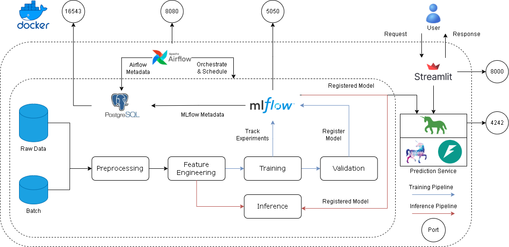
<h4 align="center">Framework</h4>

# Key Features
1. **Data Pipeline and Workflow Management**
- Airflow: Manages and schedules the workflow, model training and inference pipelines.
- Model Selection: Support to set up multiple models and respective parameters, train-test split functions for experiments comparison.
2. **Machine Learning Models**
- Data Preprocessing: Automated generating exploratory data analysis reports, providing an overview and helpful insights about data for data preprocessing step.
- Feature Engineering: Automated handling of categorical features (Ordinal and Nominal) and preprocessing pipelines (e.g., encoding, resampling (solves imbalance class issue), scaling).
- Model Performance Tracking: MLflow integration to log metrics, hyperparameters, and performance.
3. **Web UI Services**
- FastAPI: Backend service for handling predictions and API requests.
- Streamlit: Frontend interface for visualizing predictions, reports, and model performance (e.g., confusion matrix, ROC curve, feature importance).
4. **Database Management**
- PostgreSQL: Centralized database for data storage, such as services' metadata, prediction results.
# Tools / Technologies
- Platform: [Docker](https://www.docker.com/)
- Pipeline orchestrator: [Airflow](https://airflow.apache.org/)
- Experiment tracking / Model registry: [MLflow](https://mlflow.org/)
- Machine Learning Models: [GradientBoostingClassifier](https://scikit-learn.org/stable/modules/generated/sklearn.ensemble.GradientBoostingClassifier.html), [LogisticRegression](https://scikit-learn.org/1.5/modules/generated/sklearn.linear_model.LogisticRegression.html)
- Machine Learning service deployment: [FastAPI](https://fastapi.tiangolo.com/), [Uvicorn](https://www.uvicorn.org/), [Gunicorn](https://gunicorn.org/)
- Database: [PostgreSQL](https://www.postgresql.org/)
- Database UI for Postgres: [pgAdmin](https://www.pgadmin.org/)
- Web Interface: [Streamlit](https://streamlit.io/)

# How things work

- Run DAGs on airflow web service.

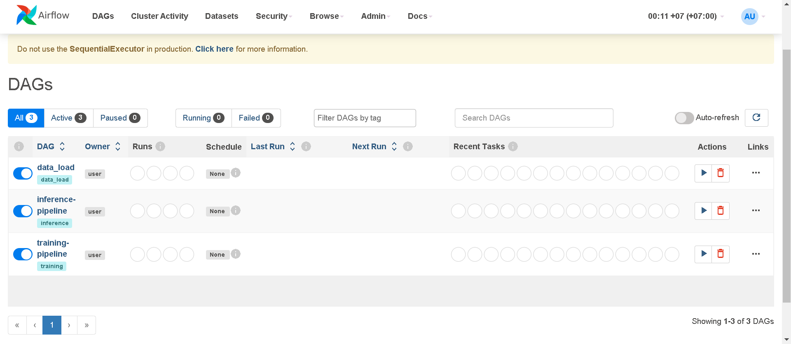
<h4 align="center">Airflow DAGs</h4>

- During the evaluation of training experiments, experimental information such as metrics and parameters is logged and managed by MLflow.

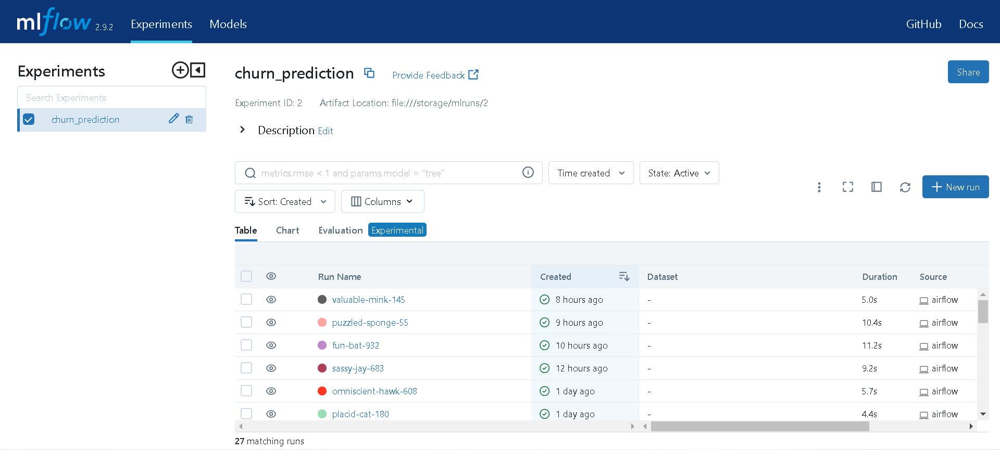
<h4 align="center">MLflow Experiment Tracking</h4>

- Models that meet the required conditions are registered and prepared for real-world deployment. Each model can be labeled according to its stage, such as "Staging" or "Production".

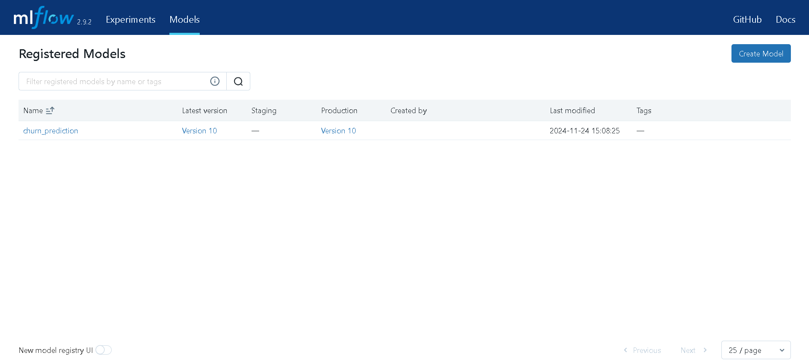
<h4 align="center">MLflow Registered Models</h4>

- The Streamlit-powered web page provides a quick overview of the data, model performance, and facilitates predictions.

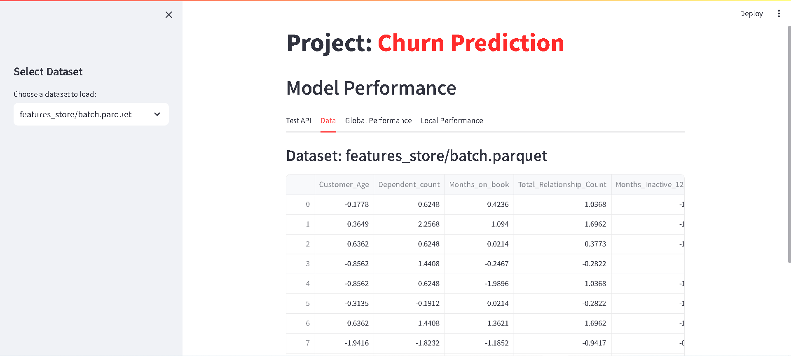
<h4 align="center">Data Viewer on Streamlit</h4>

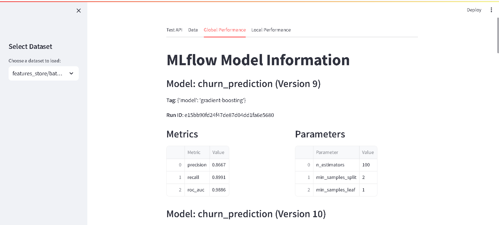
<h4 align="center">Model Information Viewer on Streamlit</h4>

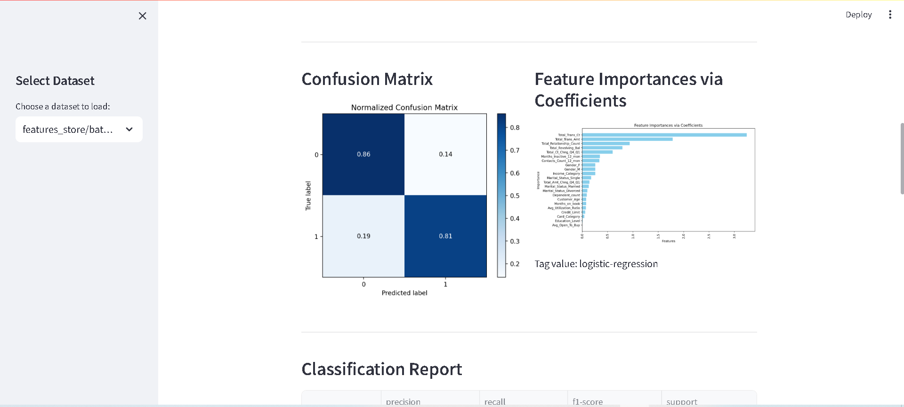
<h4 align="center">Confusion Matrix & Feature Importances Viewer on Streamlit</h4>

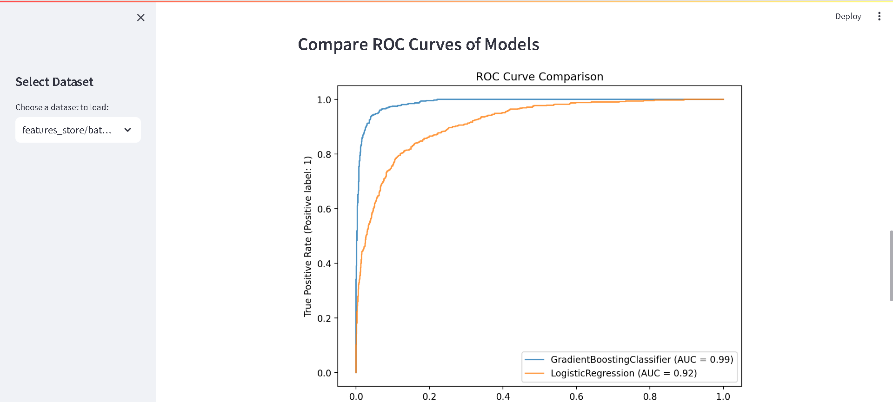
<h4 align="center">ROC Curves Viewer on Streamlit</h4>

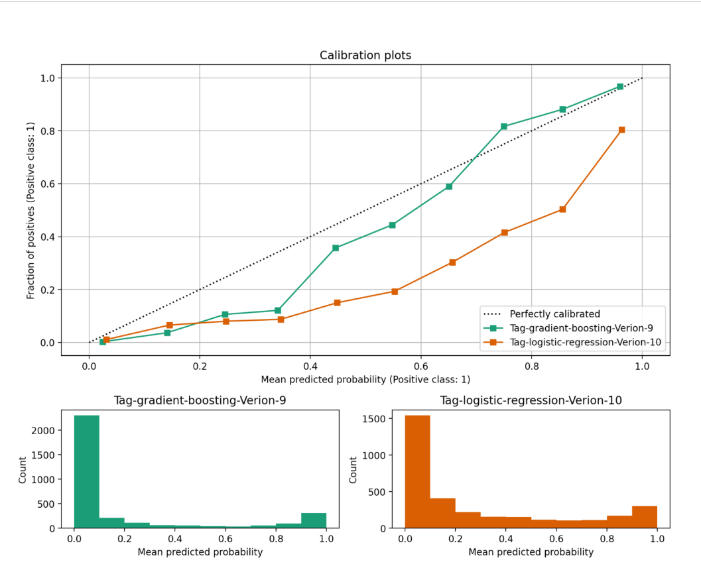
<h4 align="center">Calibration Plots on Streamlit</h4>

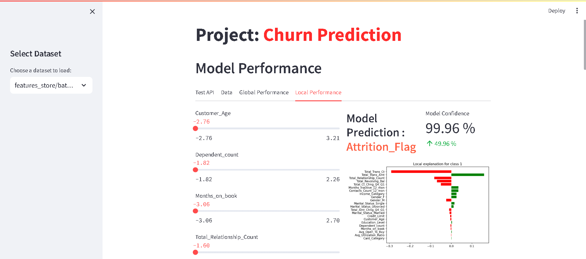
<h4 align="center">Local Interpretable Model-Agnostic Explanations (LIME) on Streamlit</h4>

- Prediction results, along with Airflow metadata and MLflow metadata, are stored in PostgreSQL.

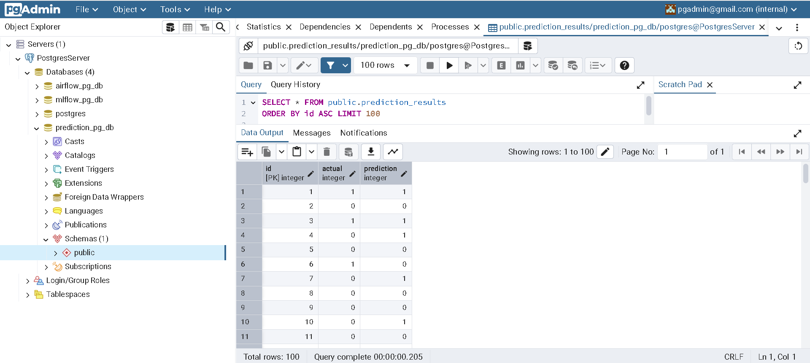
<h4 align="center">Prediction Results Table on Postgres</h4>


# How to set up
### Download
```
git clone https://github.com/Doanh-Chinh/Airflow-MLflow-Churn-Prediction
cd Airflow-MLflow-Churn-Prediction
```
### Start
Build and start the containers:
```
docker compose up
```
### Access
Access on web service:

- Airflow: `localhost:8080` (Username: `admin`, Password: `admin`).  
- pgAdmin: `localhost:16543` (Email: `pgadmin@gmail.com`, Password: `pgadmin`)
- MLflow: `localhost:5050`
- Streamlit: `localhost:8000`
### Stop
To stop and remove all containers:
```
docker compose down
```


<p align="right">(<a href="#readme-top">back to top</a>)</p>

# Things to improve
There are some features can be added in the future:
- **Incremental Data Updates**: Implement daily or periodic updates to handle new data, ensuring real-time insights and system relevance.

- **Automated Model Retraining**: Set up workflows to automatically retrain models with the latest data when model performance declines below a threshold.
# References
- Reservation Cancellation Forecasting: a Senior Machine Learning Engineer assignment [[source](https://github.com/jeremyarancio/reservation_cancellation_prediction)]
- Sales Forecast MLOps at Scale [[source](https://github.com/jomariya23156/sales-forecast-mlops-at-scale/tree/master)]
- ML Dashboard using Streamlit [[source](https://www.youtube.com/watch?v=gdNknCDf2LU)]


<!-- Badges -->
[forks-shield]: https://img.shields.io/github/forks/Doanh-Chinh/Airflow-ETL-AdventureWorks.svg?style=for-the-badge
[forks-url]: https://github.com/Doanh-Chinh/Airflow-ETL-AdventureWorks/network/members
[stars-shield]: https://img.shields.io/github/stars/Doanh-Chinh/Airflow-ETL-AdventureWorks.svg?style=for-the-badge
[stars-url]: https://github.com/Doanh-Chinh/Airflow-ETL-AdventureWorks/stargazers
[linkedin-shield]: https://img.shields.io/badge/LinkedIn-Profile-blue?style=for-the-badge&logo=linkedin
[linkedin-url]: https://www.linkedin.com/in/chinh-luong-doanh/